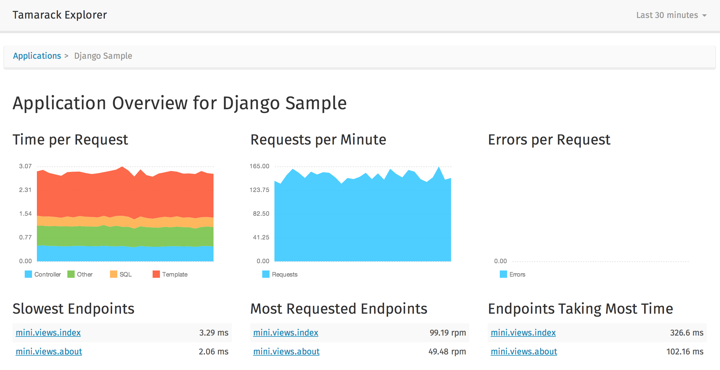

==========
 Tamarack
==========

.. image:: https://travis-ci.org/mhallin/tamarack.svg?branch=develop
   :target: https://travis-ci.org/mhallin/tamarack

Tamarack is a quantitative web application profiler. It will track the
performance of all requests made to your app, aggregate them, and
present them so you can identify bottlenecks and track improvements
and regressions.

Tamarack consists of three parts: a *collector library* which resides
in your application. The collector will feed the *receiver server*
data, which is then presented in the *explorer*. The data is stored in
PostgreSQL_ and can be scaled up depending on the needs of your
application. The collector is designed to cause minimal overhead in
your application.

The data is available in near real time, with only a few minutes of
delay to give all servers time to gather the statistics.

There is currently only an implementation of the Tamarack Collector in
Python primarily for Django, with Flask support coming soon. The
receiver API is a simple HTTP API, so writing bindings for your
language should not be hard.

Setting It Up
=============

Your system will need some basic packages before getting Tamarack up
and running:

* Python 3.4, with development libraries (``python3.4``,
  ``python3.4-dev``)
* Python package installer (``python3-pip``)
* PostgreSQL 9.3 or later, with extension modules (``postgresql-9.3``,
  ``postgresql-contrib-9.3``)

Once those packages have been installed, you can begin setting up
Tamarack. The first thing you will need is a virtual environment where
all Python packages will be installed:

.. code-block:: sh

    # Install virtualenv globally if you don't have it installed already
    pip3 install virtualenv

    # Create a Tamarack environment in /var/lib
    virtualenv -p `which python3.4` /var/lib/tamarack

    # Step into this virtual environment
    source /var/lib/tamarack/bin/activate

    # Install Tamarack from GitHub
    pip install https://github.com/mhallin/tamarack/archive/develop.zip

    # Create a configuration file
    tamarack init /etc/tamarack.py

This will generate a configuration file at ``/etc/tamarack.py``, which
you will need to edit with the settings for your system. When you're
done, you're ready to start Tamarack:

.. code-block:: sh

    tamarack --config=/etc/tamarack.py server

This will start an HTTP server on port 3000, which you can visit in a
web browser.

Where to Go From Here?
======================

If you followed the instructions above and visited the page, you
probably noticed that the list of applications is empty. Now you will
need to integrate the `Tamarack Collector`_ in your application in
order to start receiving profiling data.

.. _PostgreSQL: http://www.postgresql.org/

.. _Tamarack Collector: https://github.com/mhallin/tamarack-collector-py
